# Pyth Dune Dashboard

*Note: screenshots of Dune visualizations are taken at 8 July 2022, ~07:00:00 GMT*

Find the full Dune Dashboard [here](https://dune.com/cctdaniel/pyth-oracle).

---

This dashboard was created by a Pyth contributor to further provide relevant statistics around the Pyth network, its operations and price feed, as well as its usage by protocols and users.

If you have any relevant metrics you’d like to see on this dashboard, come let us know in our [Discord](https://discord.gg/invite/PythNetwork).

---

### Price Accounts

All price feed IDs can be found [here](https://pyth.network/developers/price-feed-ids/).

**Past 1W Price Accounts Count — Pyth Oracle Price Accounts Count (1W)**

This data point tracks how many Pyth price feeds have received at least one publisher price update in the past week. 

**Past 1W Price Updates — Pyth Oracle Price Accounts (1W)**

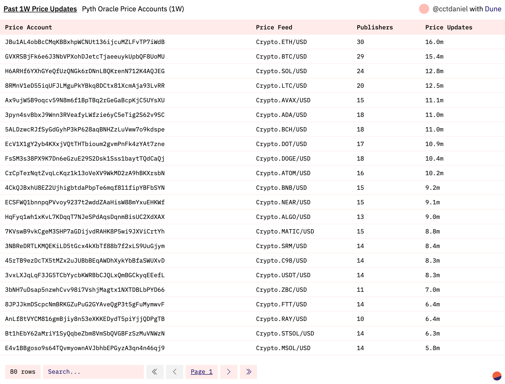

This table returns all Pyth price accounts that received at least one publisher price update in the past week, the number of active publishers that contributed to it, as well as the total count of price updates provided by all publishers.

*The Crypto.USDT/USD price feed saw 14 different publishers submitting at least one price update in the past week. In total, these 14 publishers submitted 8.3M distinct price updates on the USDT/USD price feed.*

**Past 1W Price Updates By Price Feeds — Pyth Oracle Price Accounts (1W)**

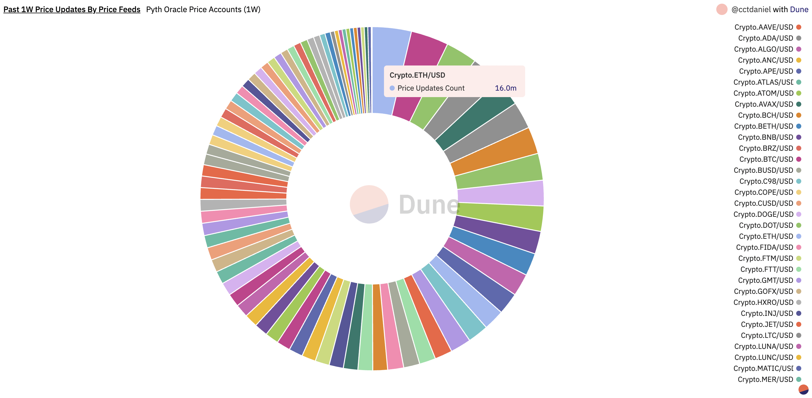

This pie chart displays how many individual price updates from publishers a price feed has received in the past week. 

**Past 1W Price Updates By Publishers Count — Pyth Oracle Price Accounts (1W)**

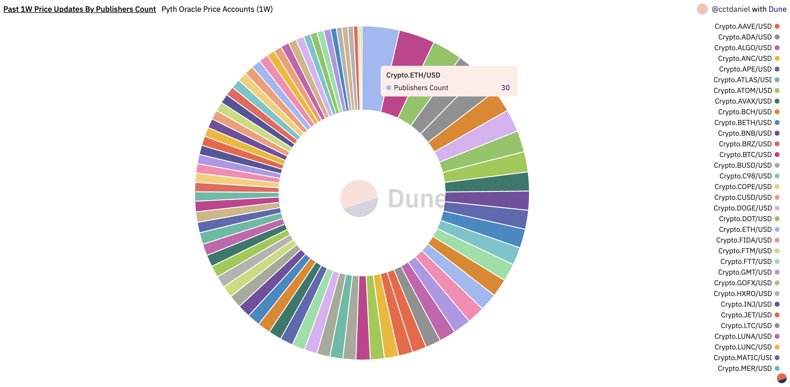

This pie chart displays how many distinct publishers have been active on each price feed in the past week. 

**Past 24H Publisher Price Updates Ix Count — Pyth Oracle Daily Publisher Price Updates Ix Count**

EMBEDDED GRAPH / OR PICTURE

This data point tracks the total number of instructions that were called by the Pyth network publishers over the last 24 hours.

**Past 1M Publisher Price Updates Ix Count — Pyth Oracle Daily Publisher Price Updates Ix Count (1M)**

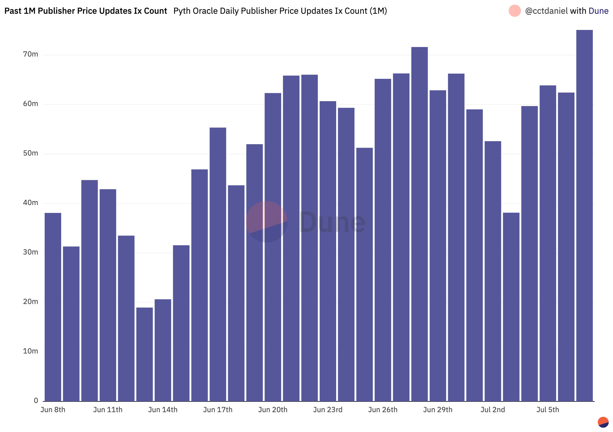

This bar chart displays the total number of instructions that were called by the Pyth network publishers over the last month.

**Past 24H Publisher Price Updates Tx Count — Pyth Oracle Daily Publisher Price Updates Tx Count**

This data point tracks the total number of Solana transactions performed by the Pyth network publishers over the last 24 hours.

Publishers submit price updates to the Pyth on-chain program by submitting Solana transactions.

**Past 1M Publisher Price Updates Tx Count — Pyth Oracle Daily Publisher Price Updates Tx Count (1M)**

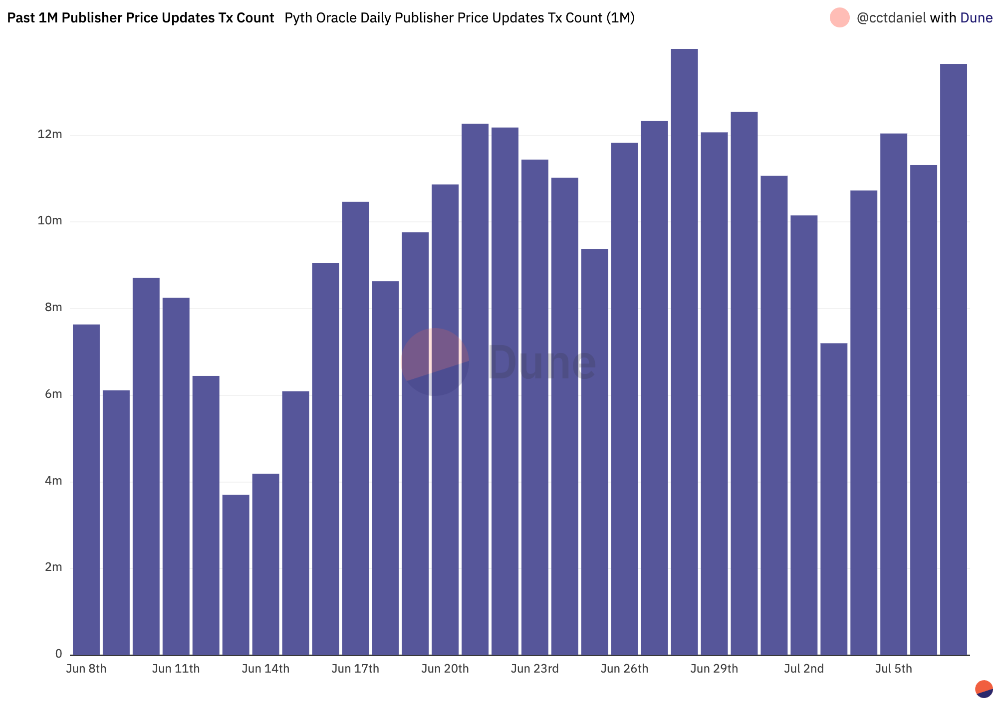

This bar chart displays the total number of Solana transactions performed by the Pyth network publishers over the last month.

**Past 24H Most Used Price Feed — Pyth Oracle Daily Ix Count By Price Feeds**

This data point returns the price feed that received the most instructions coming from the Pyth network users.

**Past 1M Most Used Price Feeds — Pyth Oracle Daily Ix Count By Price Feeds (1M)**

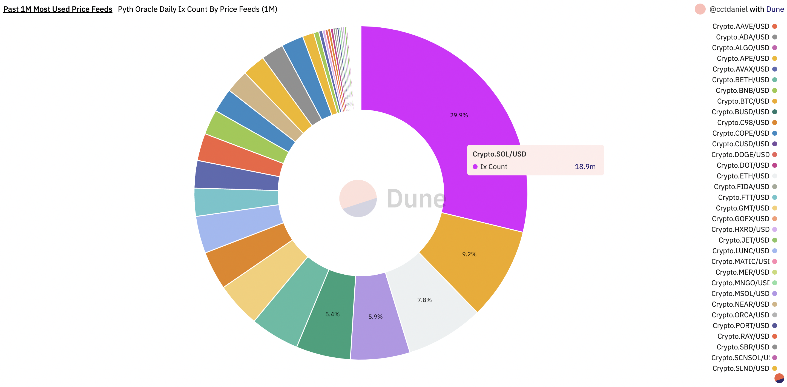

This pie chart displays both the nominal usage of each Pyth price feed as well as its share within the whole set of Pyth price feeds.

*The Crypto.SOL/USD price feed was called approximately 18.9M times by users last month. It represents about 1/3 of all Pyth users’ instructions.* 

### Publishers

The full list of publishers can be found [here](https://pyth.network/publishers/).

**Past 1W Active Publishers Count — Pyth Oracle Active Publishers Count (1W)**

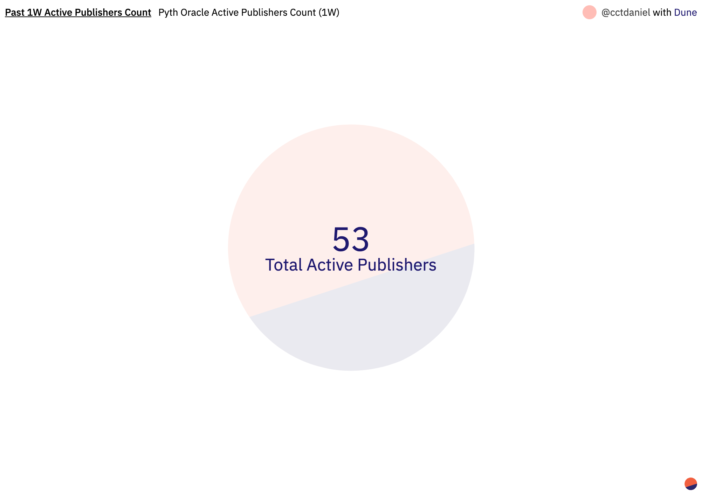

This data point tracks how many distinct Pyth network publishers have submitted at least one price update in the last week.

**Past 1W Active Publishers — Pyth Oracle Active Publishers (1W)**

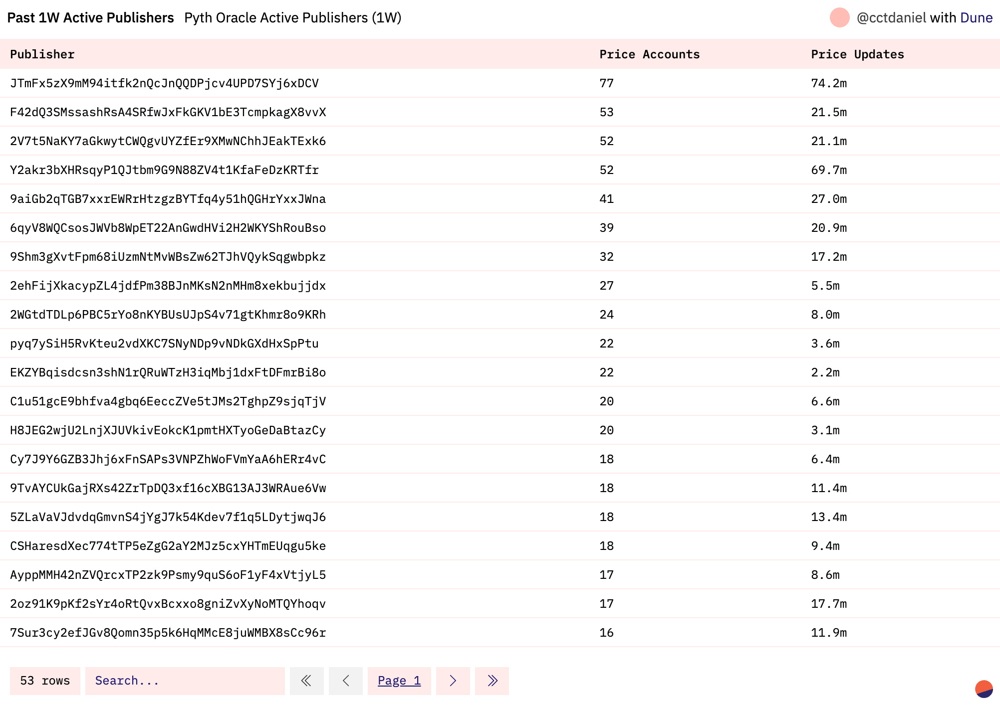

This table returns each publisher's activity:
1. how many price feeds they have submitted a price update to and
2. the total of price updates provided over the last week

**Past 1W Active Publishers By Price Accounts Count — Pyth Oracle Active Publishers (1W)**

This pie chart displays the number of price accounts each publisher provides price updates to for the past week.

**Past 1W Active Publishers By Price Updates Count — Pyth Oracle Active Publishers (1W)**

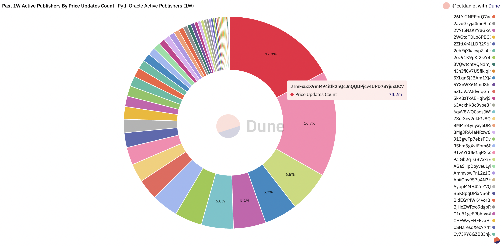

This pie chart displays the share of each publisher total price updates provided to the Pyth network price feeds for the past week.

*JTmFx5zX9mM94itfk2nQcJnQQDPjcv4UPD7SYj6xDCV provided about 17.8% (74.2M individual updates) of all the single price updates submitted by the Pyth network publishers.*

**Past 24H Fees — Pyth Oracle Daily Fees In SOL**

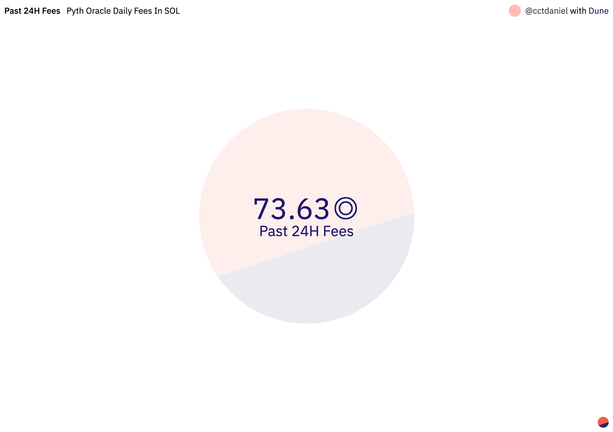

This data point tracks the last 24 hours SOL consumption from all the publishers providing data to the network. 

**Past 1M Fees — Pyth Oracle Daily Fees In SOL (1M)**

This bar chart displays the last 30 days’ daily SOL consumption from all the publishers providing data to the network.  

*A trend increase in fees could come from: (1) more publishers, (2) more price feeds, and (3) a better uptime/slot hit rate (which is also correlated to Solana TPS performance).*

**Past 1M Fees By Publisher — Pyth Oracle Daily Fees In SOL By Publisher (1M)**

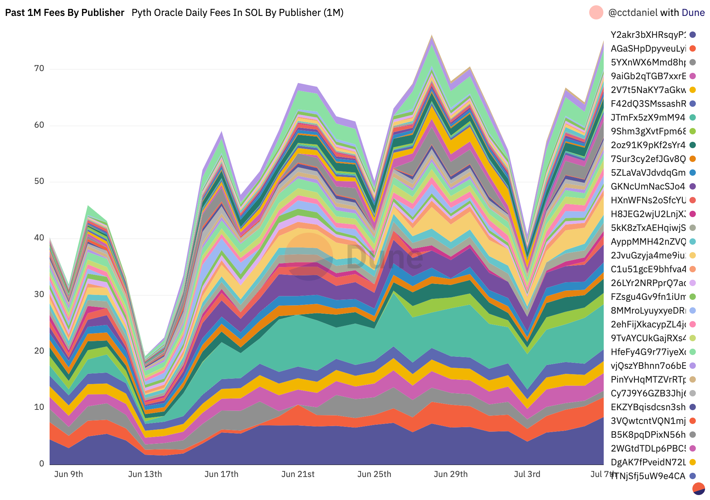

This stacked area chart displays the individual daily SOL consumption of each publisher over the last 30 days.

*The more a publisher spends, the more likely he is active on more price feeds and/or has a better uptime (more price updates) than the others.*

### Consumers

Who's #PoweredByPyth? Find the known integration on our [website](https://pyth.network/consumers/).

**Past 24H Daily Active Consumers — Pyth Oracle Daily Active Consumers**

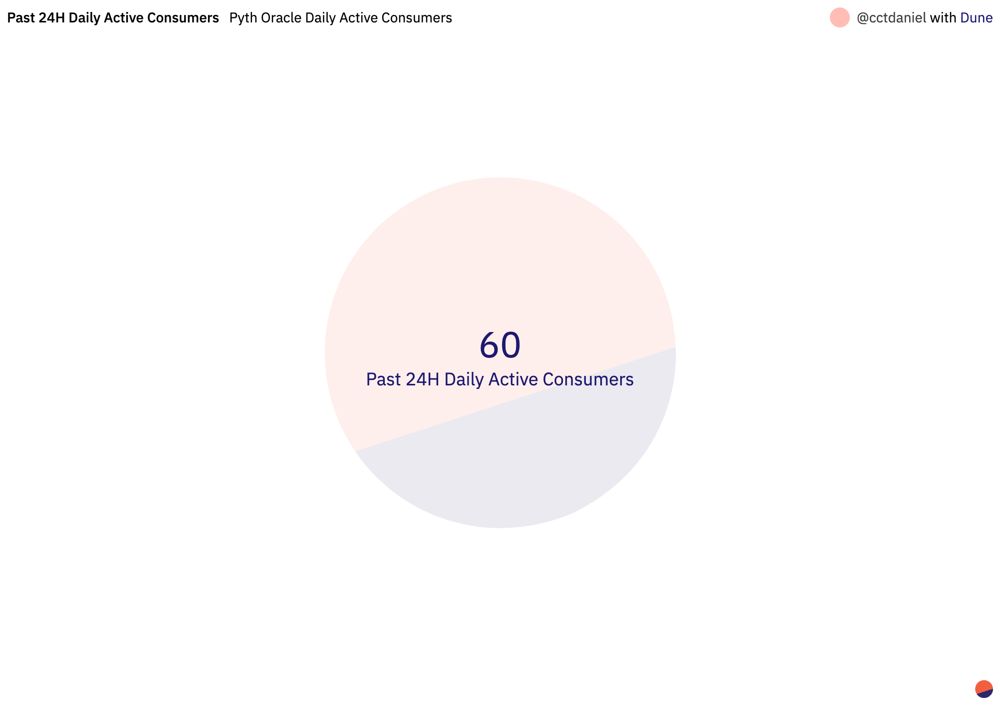

This data point returns how many distinct on-chain programs have interacted and called any of the Pyth price feeds in the last 24 hours.

Off-chain integration of the Pyth price feeds are not included in the data.

 **Past 1M Daily Active Consumers — Pyth Oracle Daily Active Consumers (1M)**

This line chart displays the evolution of how many distinct on-chain programs have interacted and called any of the Pyth price feeds in the last month.

**Past 1M Consumers Ix Count — Pyth Oracle Daily Consumer Ix Count By Program (1M)**

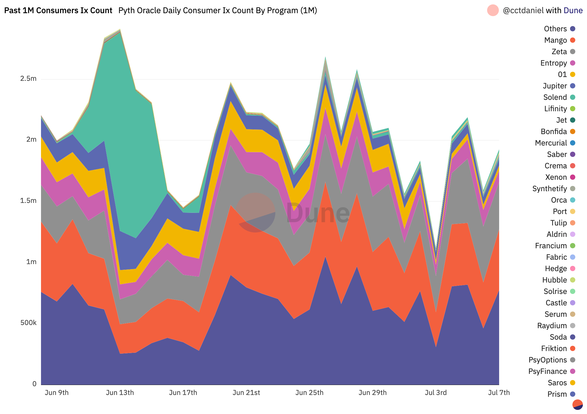

This stacked area chart displays how many instructions including the Pyth smart contract have been made by on-chain programs in the last month.

### Users

Users are defined as addresses that have signed transactions interacting with programs using Pyth price feeds.

**Past 24H Daily Active Users — Pyth Oracle Daily Active Users**

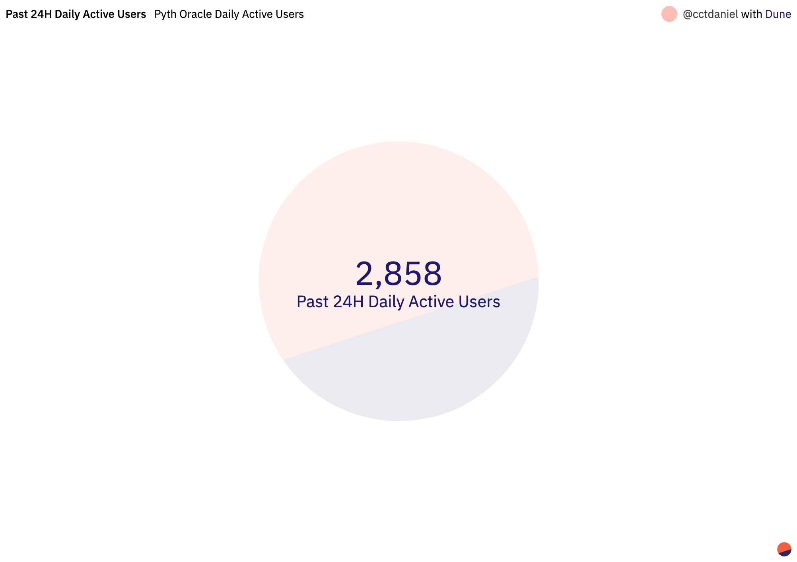

This data point returns how many distinct wallets/users have interacted with programs that compose with the Pyth program in the last 24 hours.

**Past 1M Daily Active Users — Pyth Oracle Daily Active Users (1M)**

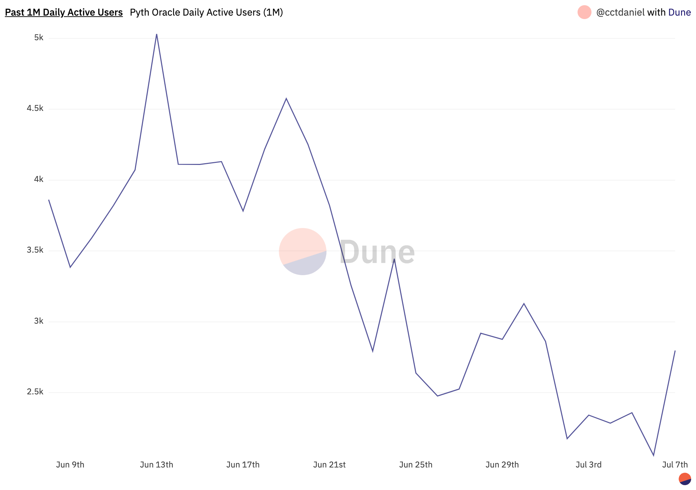

This line chart displays how many distinct wallets/users have interacted with programs that compose with the Pyth program over the last month.

**Past 24H Daily User Interactions — Pyth Oracle Daily Active Users**

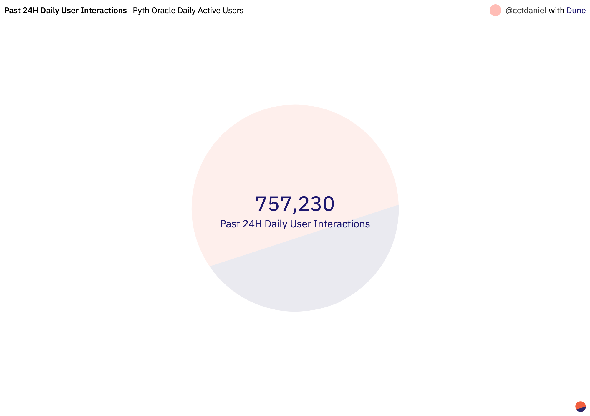

This data point returns the total amount of interactions wallets/users have performed with programs that compose with Pyth in the last 24 hours.

**Past 1M Daily User Interactions — Pyth Oracle Daily Active Users (1M)**

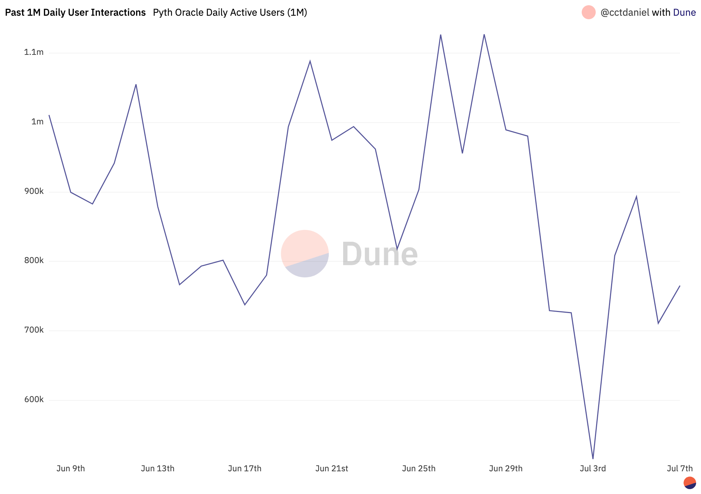

This line chart displays the total amount of interactions wallets/users have performed with programs that compose with Pyth over the last month.
