# Pyth Network KPI - April 2023

**Overall Momentum**

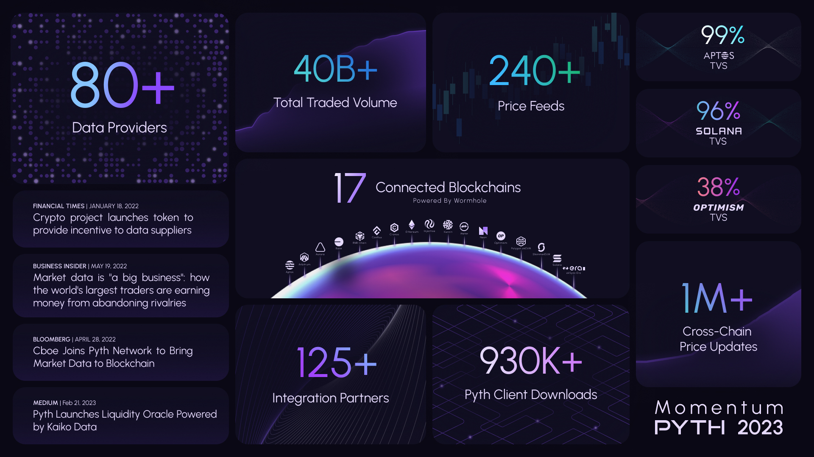

**Monthly Recap**

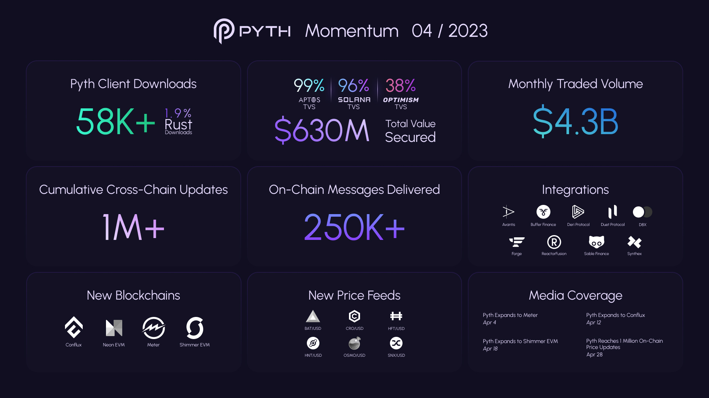

**Data Publishers**

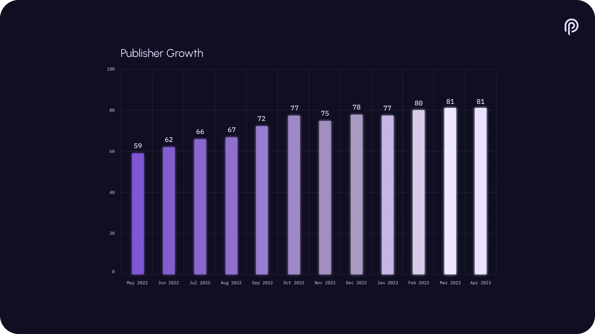

**Price Feeds**

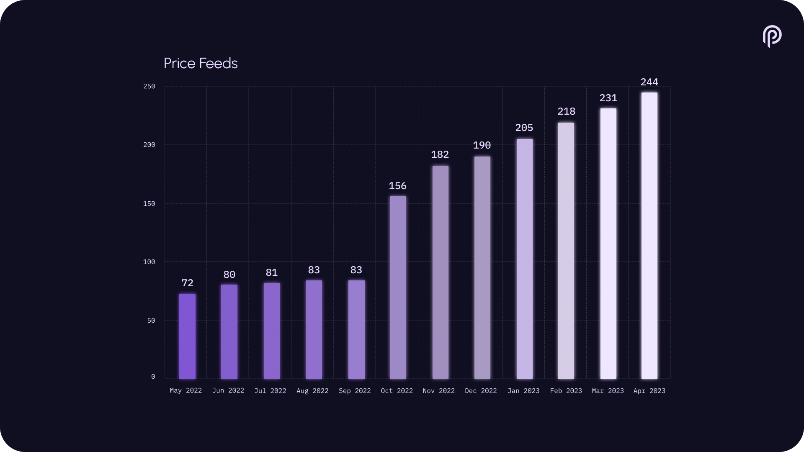

**#PoweredByPyth Applications**

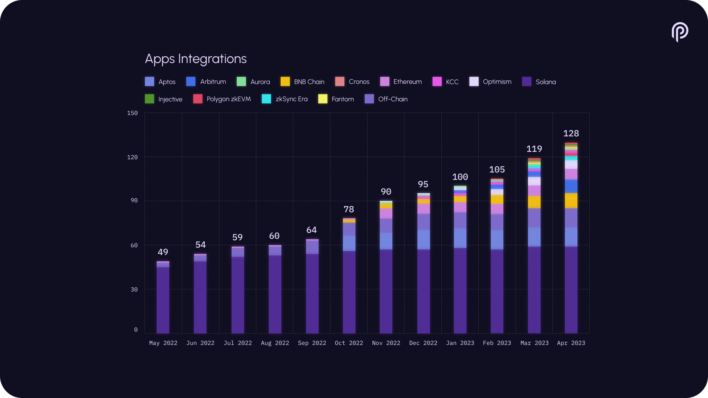

**Total Value Secured**

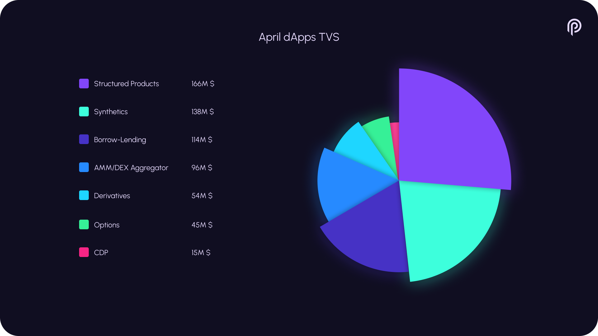

**Cumulative Trading Volume**

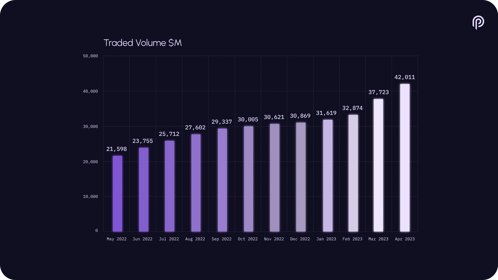

**Monthly Trading Volume**

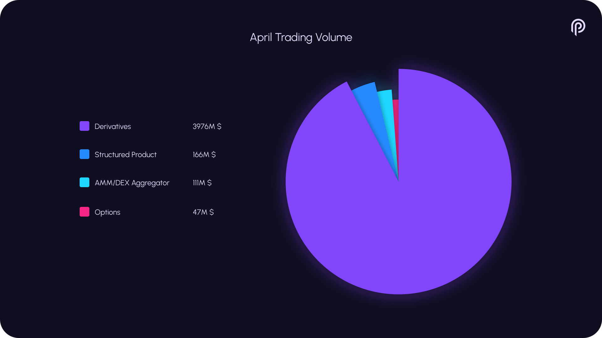

**Client Downloads**

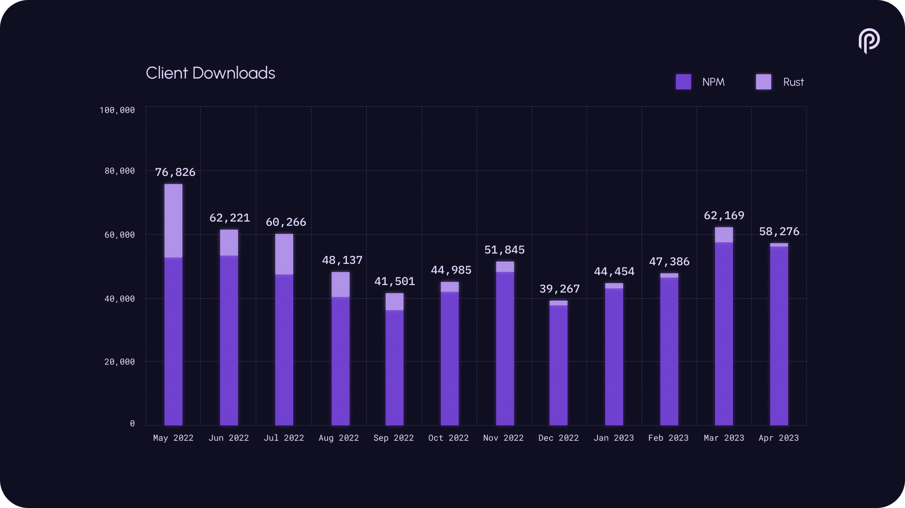

**Connected Blockchains**

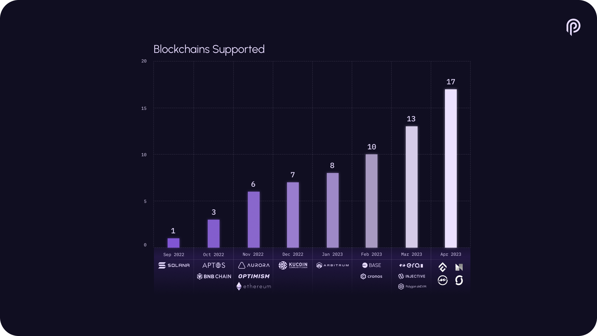

**Cross-chain Price Updates**

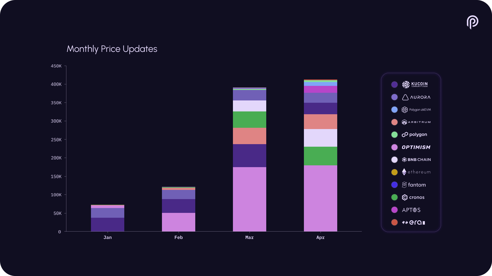