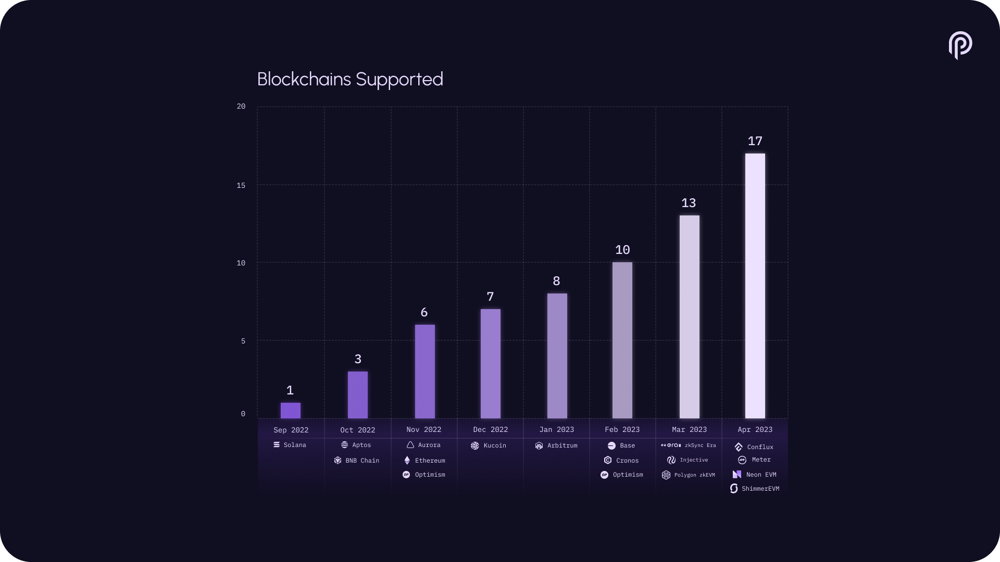

# Pyth Network KPI - April 2023

**Overall Momentum**

**Monthly Recap**

**Data Publishers**

**Price Feeds**

**#PoweredByPyth Applications**

**Total Value Secured**

**Cumulative Trading Volume**

**Monthly Trading Volume**

**Client Downloads**

**Connected Blockchains**

**Cross-chain Price Updates**

