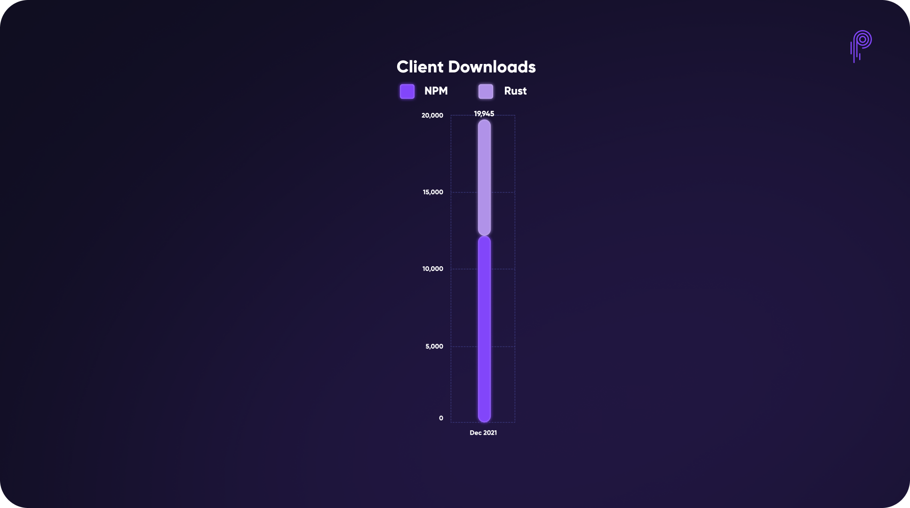

# Pyth Network KPI - December 2021

**Recap**

.jpeg)

**Data Publishers**

.png)

**Price Feeds**

.png)

**#PoweredByPyth Applications**

.jpeg)

**Total Value Secured**

.jpeg)

**Total Trading Volume**

.png)

**Client Downloads**

