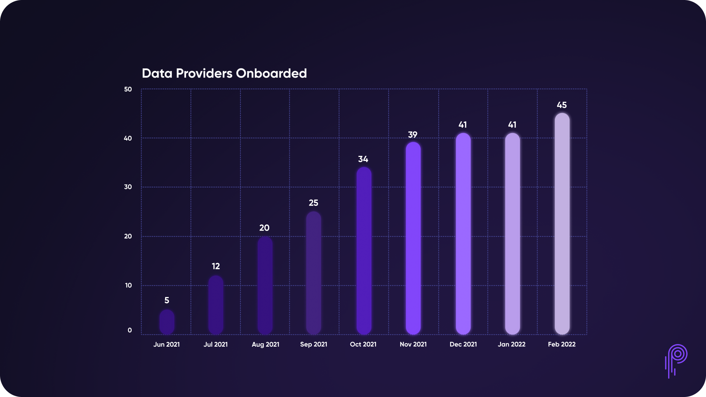
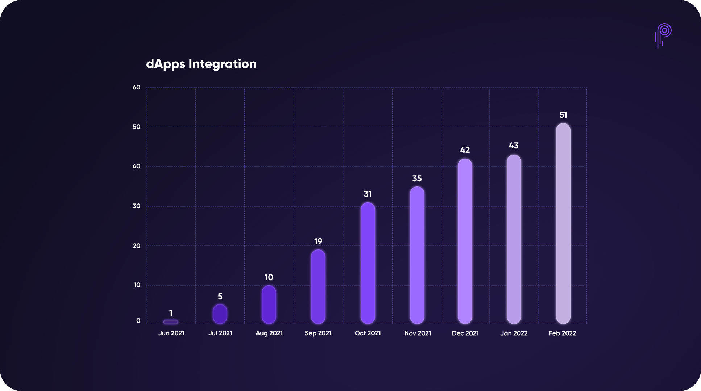
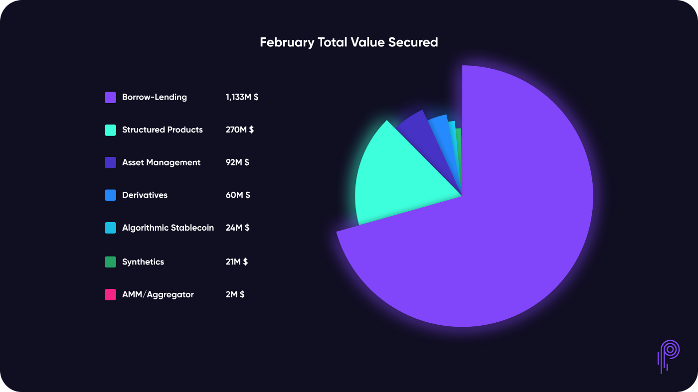

# Pyth Network KPI - February 2022

**Recap**

.png)

**Data Publishers**

**Price Feeds**

**#PoweredByPyth Applications**

**Total Value Secured**

**Total Trading Volume**

.png)

**Client Downloads**

.png)