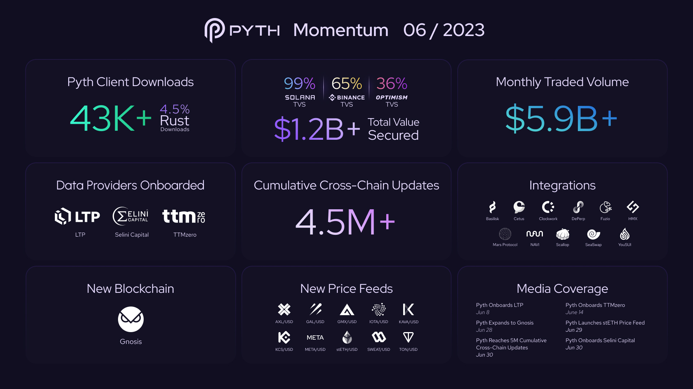

# Pyth Network KPI - June 2023

**Overall Momentum**

**Monthly Recap**

**Daily Average Fee Transactions (DAFTs)**

**#PoweredByPyth Applications**

**Price Feeds**

**Data Providers**

**All Chain Total Value Secured**

**Monthly Total Value Secured**

**Cumulative Traded Volume**

**All Chain Traded Volume**

**Monthly Trading Volume**

**Client Downloads**

**Connected Blockchains**

**Cross-chain Price Updates**

