# Pyth Network KPI - May 2023

**Overall Momentum**

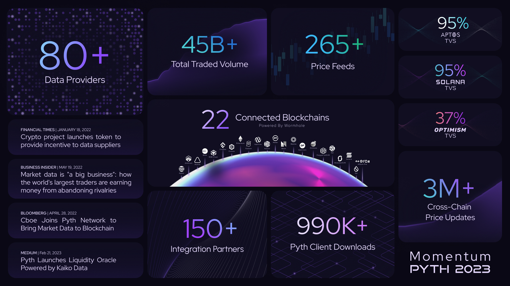

**Monthly Recap**

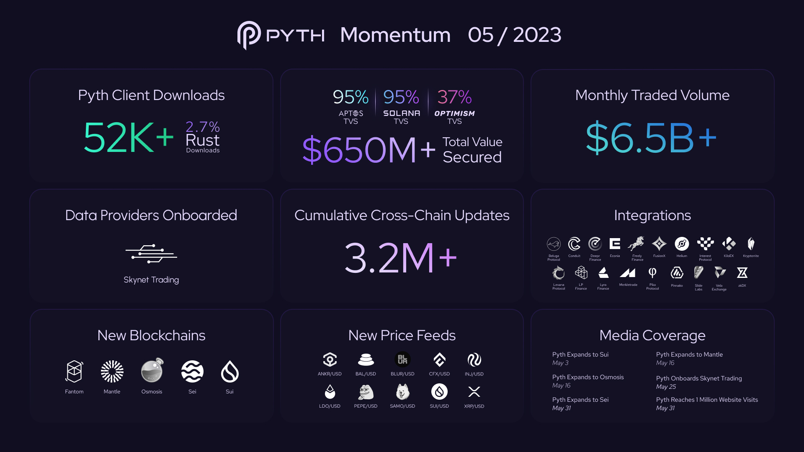

**Data Publishers**

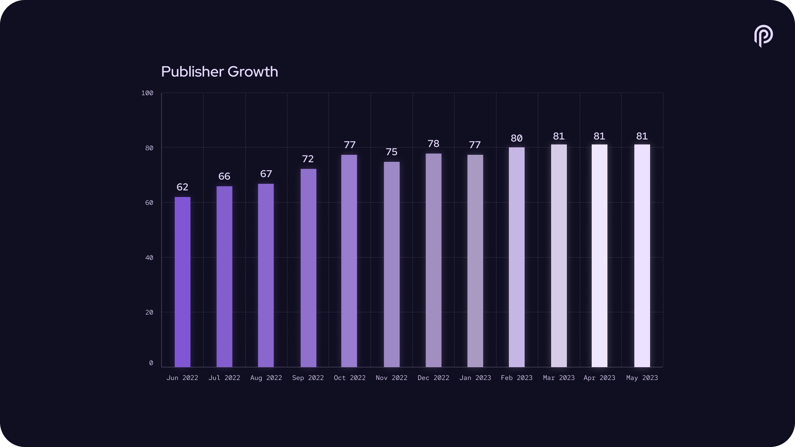

**Price Feeds**

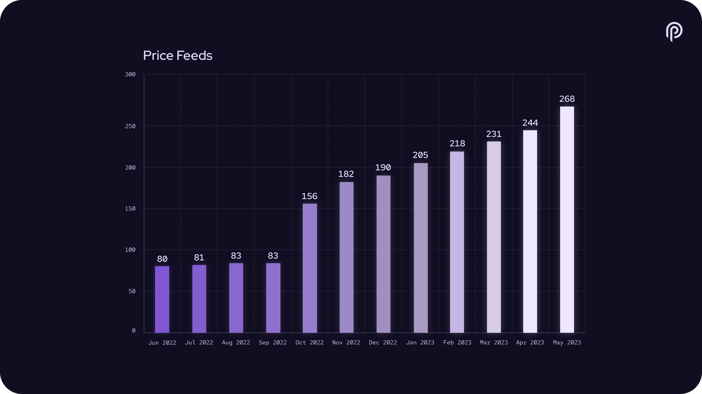

**#PoweredByPyth Applications**

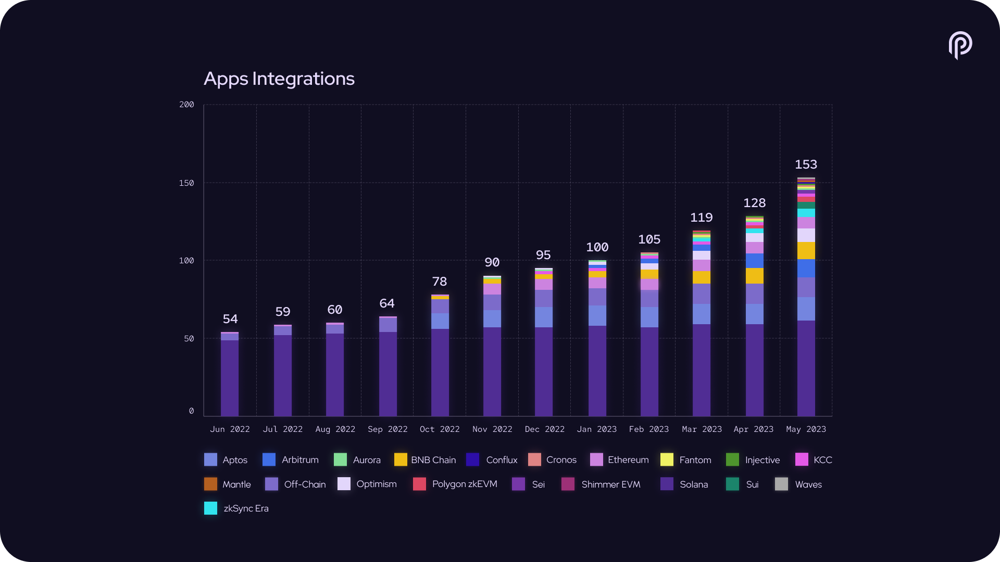

**All Chain Total Value Secured**

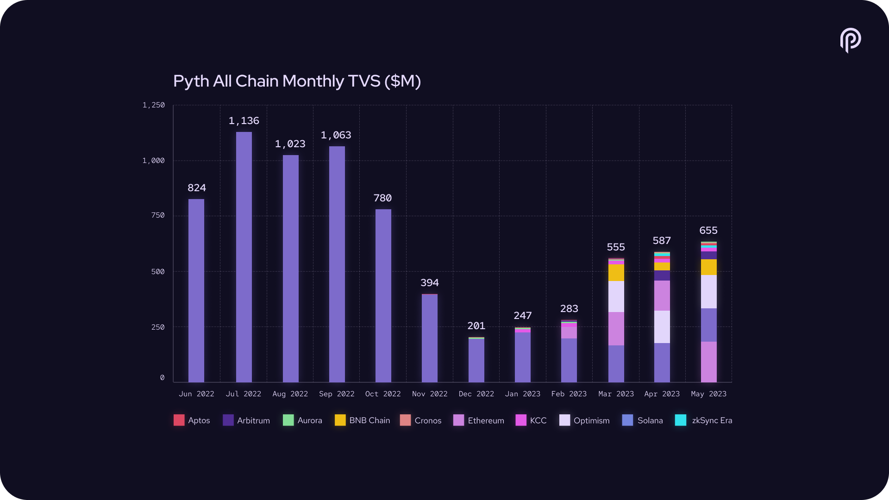

**Monthly Total Value Secured**

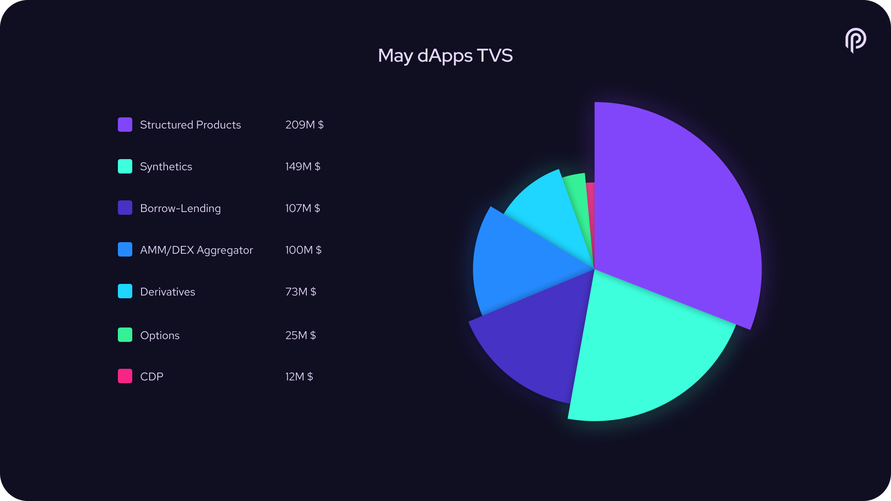

**Cumulative Traded Volume**

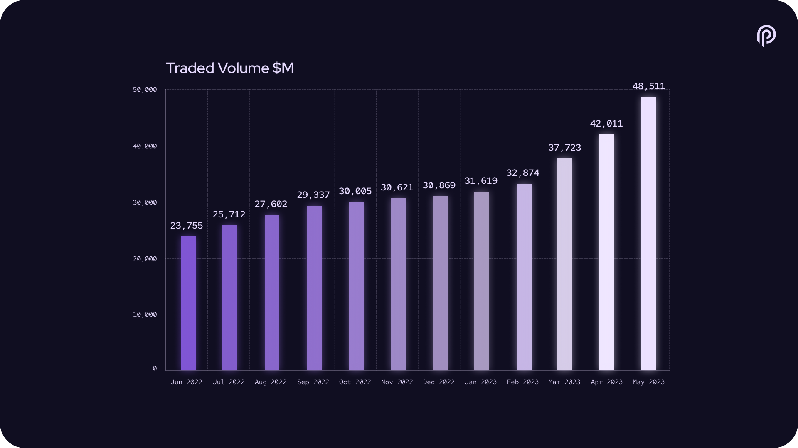

**All Chain Traded Volume**

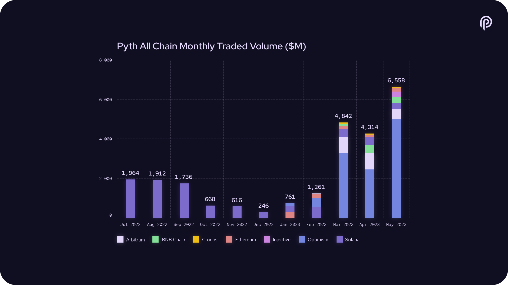

**Monthly Trading Volume**

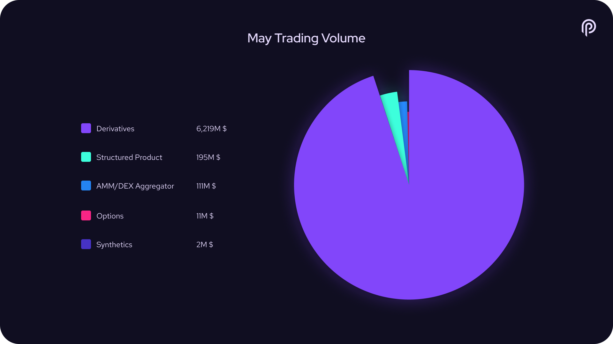

**Client Downloads**

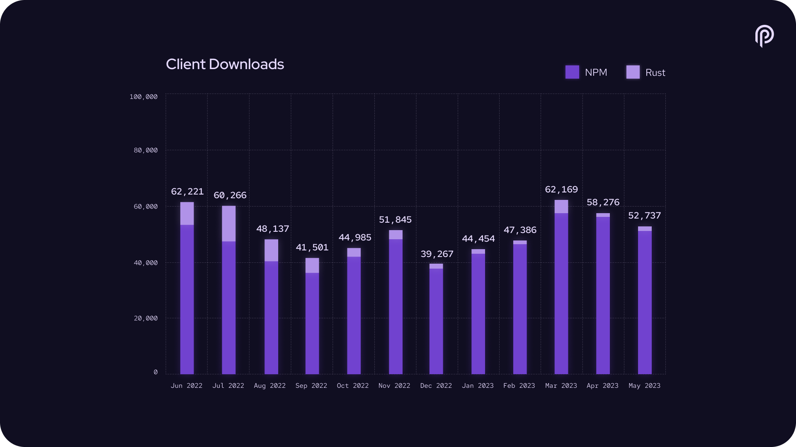

**Connected Blockchains**

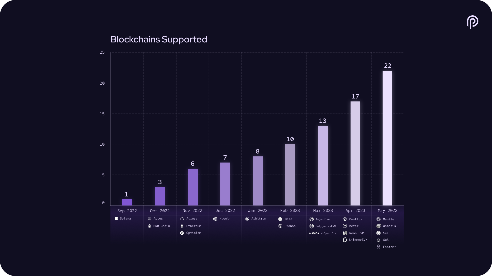

**Cross-chain Price Updates**

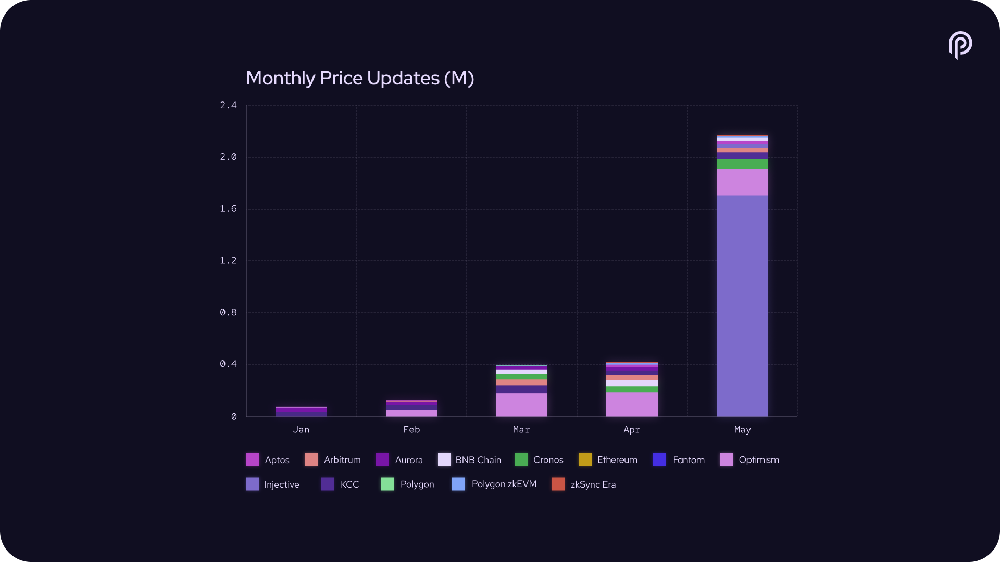