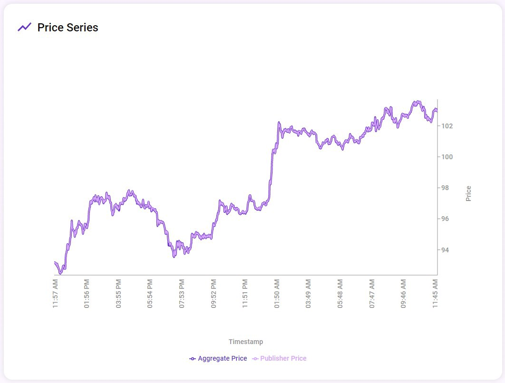
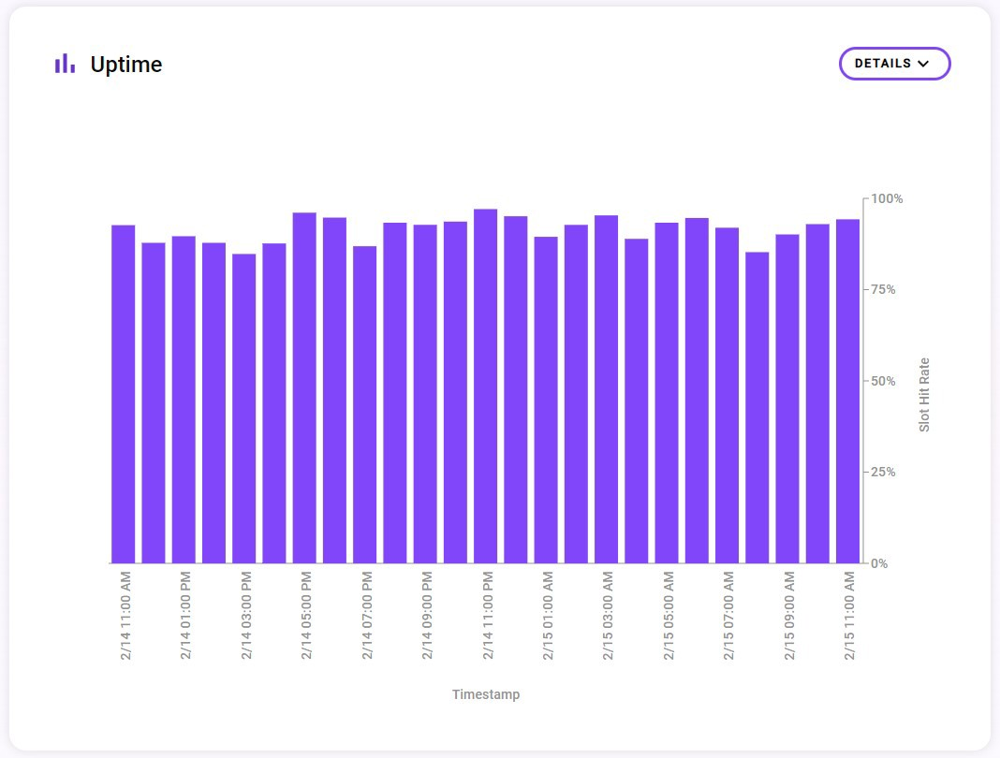
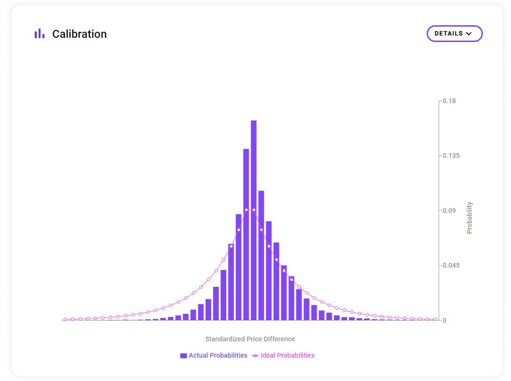
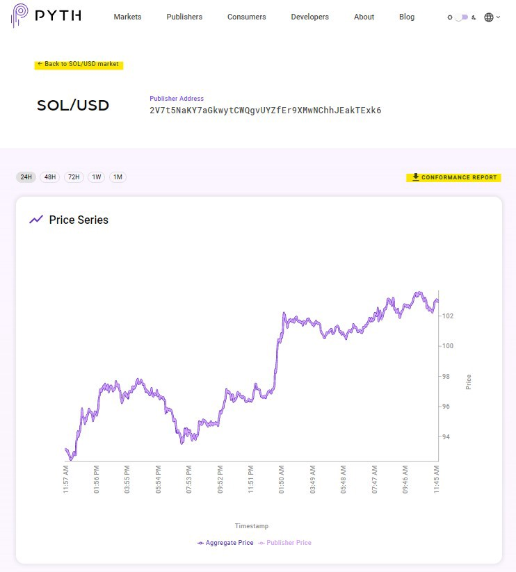

# Pyth Publishers Metrics

Pyth Publishers Metrics is a feature that provides insights that will empower developers, publishers, and delegators by providing the historical performance of the network’s data sources. This powerful tool reflects our commitment to transparency and delivering timely, accurate, and valuable first-party data for everyone.

---

**Price Series**

The **price graph** shows how a publisher’s price compares to the aggregate price, illustrating how closely the two prices track each other, and whether there were any periods where the publisher deviated significantly from the rest of the market.

**Uptime**

The **uptime graph** shows when the publisher was actively contributing prices. The x-axis subdivides the time interval into bins, and the y-axis is the % of slots in that bin where the publisher’s price was recent enough to be included in the aggregate. This graph lets you determine the regularity and reliability of a publisher.

**Quality**

The quality graph shows the dataset used in the regression model for computing the quality score described in section 4.1.1 of the [whitepaper](https://pyth.network/whitepaper.pdf). The quality score measures how well a publisher’s price series predicts future changes in the aggregate price. A smooth color gradient (from blue on the bottom left to pink on the top right) indicates a high-quality score.

**Calibration**

The **calibration graph** shows how closely the publisher’s prices and confidences match the expected Laplace distribution. The closer the fit between the two distributions, the higher the calibration score (described in section 4.1.2 of the whitepaper). In other words, a perfect publisher should produce a uniform histogram. As a reminder, the calibration score does not reward publishers for producing tighter confidence intervals; rather, the score captures whether the reported confidence interval corresponds to the publisher’s “true” confidence.

**Accessing the Metrics**

You can start at the [Pyth Markets page](https://pyth.network/price-feeds/), which will list every market symbol (“price feed”). Clicking on any price feed will bring you to the corresponding market page. We will use the [SOL/USD price page](https://pyth.network/price-feeds/#Crypto.SOL/USD) as our example.

Each price feed page has a list of price components (representing each publisher by their publisher keys). Each component will link to the corresponding Publisher Metrics page.

Once you are on a price feed, you can click on a publisher key (highlighted in yellow) under “Price Components” to access the Publishers Metrics page.

On the Metrics Page for a specific publisher, you will find the metrics graphs and the option to download a Conformance Report (TSV file).

To open the metrics for another publisher (of that same price feed), you can click on the “Back to the [SOL/USD] market”.

If you want to review the Publisher Metrics of another price feed (e.g. ETH/USD), you will need to access the relevant asset. As mentioned, the [Pyth Markets page](https://www.google.com/url?q=https://pyth.network/markets/&sa=D&source=editors&ust=1644929491591273&usg=AOvVaw3d8EHQfqVdf07vdK6uB0Xm) has the full list of price feeds.

For more details on the Pyth Publishers Metrics, please visit our [blog post](https://pythnetwork.medium.com/introducing-pyth-publishers-metrics-3b20de6f1bf3).